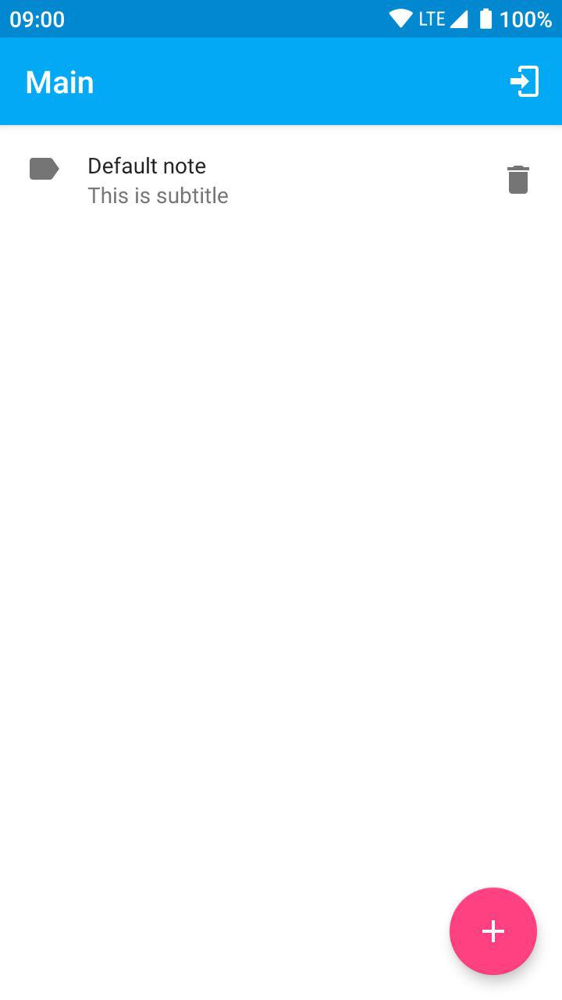
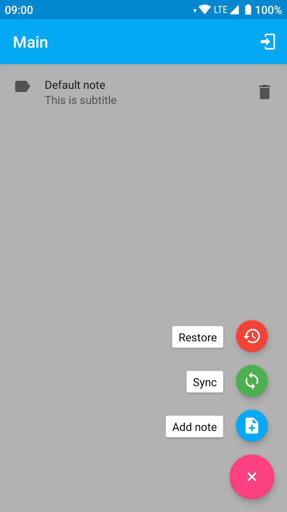
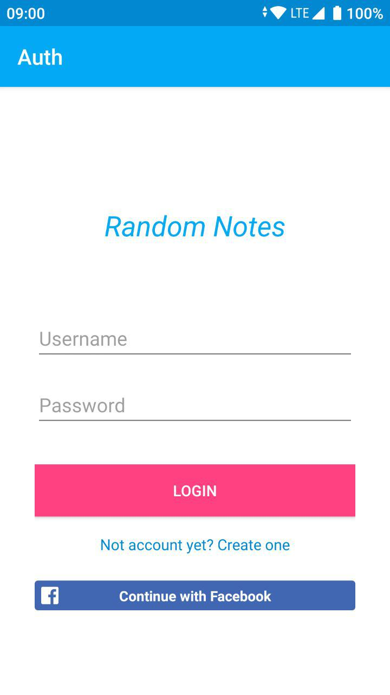
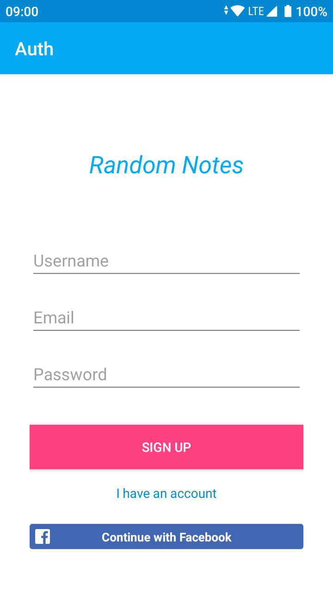

# parse-android-test-app

Test Android application for [Parse test server](https://github.com/fartem/parse-test-server)

## 1. Features

- managing simple entity (Note);
- sync data with server;
- restore data from server;
- sign up from application with email address or Facebook account;
- sign in to server with email or Facebook.

## 2. Parse initialization

```kotlin
private fun initializeParse() {
    val applicationId = "APP_ID"
    val serverAddress = "SERVER_ADDRESS"
    val clientKey = "CLIENT_KEY"

    val parseConfig = Parse.Configuration.Builder(this)
        .applicationId(applicationId)
        .clientKey(clientKey)
        .server(serverAddress)
        .build()
    Parse.initialize(parseConfig)
    ParseFacebookUtils.initialize(this)
}
```

- __APP_ID:__ Parse app id;
- __SERVER_ADDRESS:__ Parse address in your network (__example:__ http://192.168.0.9:1337/parse);
- __CLIENT_KEY:__ Parse client key;

## 3.Database

ORMLite. More on [official site](http://ormlite.com/).

## 4. Data structure

### 4.1 Entity

```kotlin
abstract class Entity(

    @DatabaseField(generatedId = true)
    var id: Long = -1

)
```

### 4.2 Note

```kotlin
class Note(

    @DatabaseField
    var title: String? = null,

    @DatabaseField
    var subtitle: String? = null,

    @DatabaseField
    var parseObjectId: String? = null,

    var positionInList: Int = 0

) : Entity() {

    ...

}
```

### 4.2.1 Save note

From Note class method:
```kotlin
fun save() {
    DatabaseFactory.get().saveNote(this)
}
```

Example:
```kotlin
    val newNote = Note(title, subtitle)
    newNote.save()
    
```

### 4.2.2 Delete note

From Note class method:
```kotlin
fun delete() {
    DatabaseFactory.get().deleteNote(this)
}
```

Example:
```kotlin
    val note = notes[notes.size - 1]
    note.delete()
```

### 4.2.3 Get all notes from database

From Note class method:
```kotlin
    fun getAllNotes() = DatabaseFactory.get().allNotes
```

Example:
```kotlin
    val notes = Note.getAllNotes()
```

### 4.2.4 Delete all notes from database

From Note class method:
```kotlin
fun deleteAllNotes() {
    DatabaseFactory.get().deleteAllNotes()
}
```

Example:
```kotlin
    Note.deleteAllNotes()
```

### 4.2.5 Get ParseObject for note

From Note class method:
```kotlin
fun getParseObject(globalAccess: Boolean = true, user: ParseUser? = null): ParseObject {
    ...
}
```

Example:
```kotlin
val parseNote = newNote.getParseObject(false, authUser)
```

### 4.2.6 Initialize note from ParseObject

From Note class method:
```kotlin
fun restoreFromParseObject(parseObject: ParseObject): ParseObject {
    ...
}
```

Example:
```kotlin
for (obj in parseObjects) {
    val note = Note()
    note.restoreFromParseObject(obj)
    ...
}
```

## 5. Facebook install

### 5.1 Resources

- [Official Guide](https://developers.facebook.com/docs/facebook-login/android)
- [Get hash with openssl from Windows](https://github.com/magus/react-native-facebook-login/issues/297#issuecomment-433816732)

### 5.2 Usage

In `preferences.xml`:

```xml
<string name="facebook_app_id">[APP_ID]</string>
<string name="fb_login_protocol_scheme">fb[APP_ID]</string>
```

## 6. Permissions

```xml
<uses-permission android:name="android.permission.INTERNET"/>
```

## 7. Screenshots

<br/>
<p align="center">
  
  
  
  
</p>