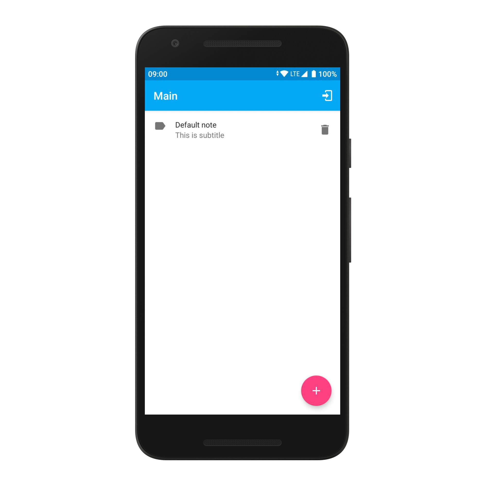
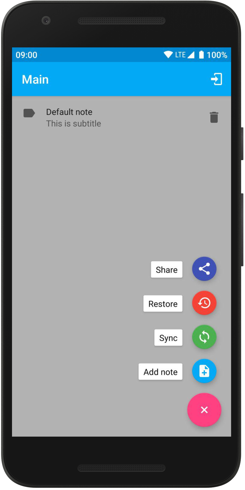
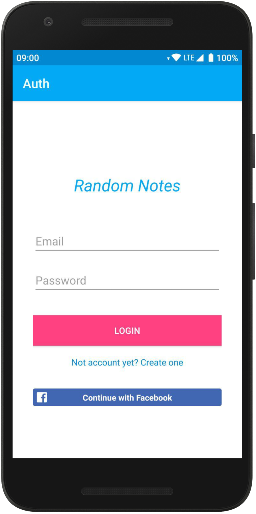
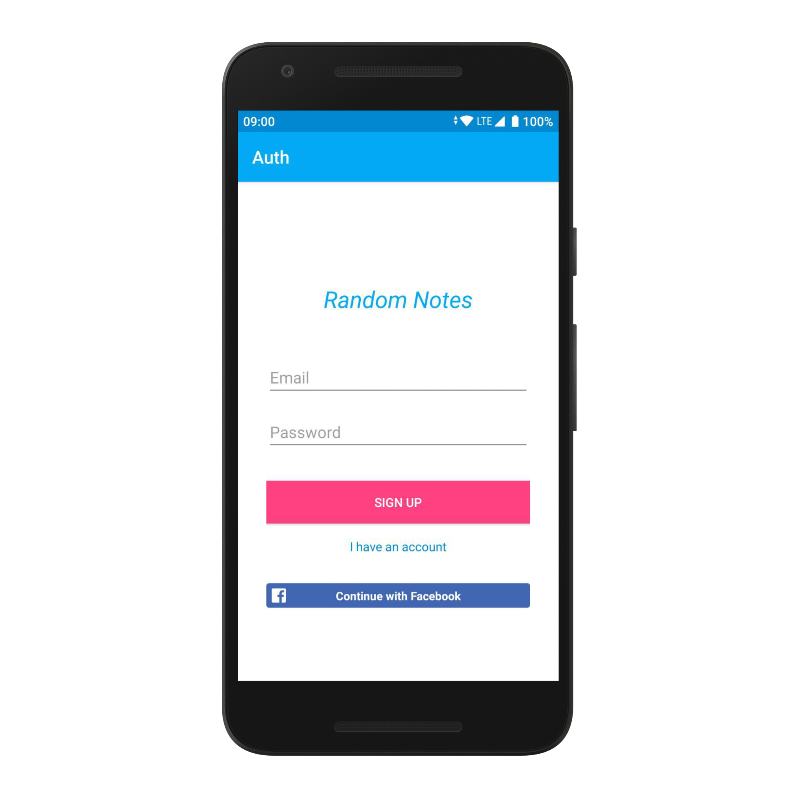

Random Notes
=======================


[](https://android-arsenal.com/details/3/7906)


About
-------------------

Test Android application for [Parse test server](https://github.com/fartem/parse-test-server).

__Features__

* managing the simple entity (Note);
* sync data with the server;
* restore data from the server;
* sign up from the application with email address or Facebook account;
* sign in to the server with email or Facebook.

__Not handling exceptions__

* Internet connection unavailable status;
* Parse Server connection unavailable status.

Facebook auth
-------------------

__Resources__

* [Official Guide](https://developers.facebook.com/docs/facebook-login/android)
* [Get hash with openssl in Windows](https://github.com/magus/react-native-facebook-login/issues/297#issuecomment-433816732)

__Usage__

In `preferences.xml` replace this values to own analogues:

```xml
<string name="facebook_app_id">[APP_ID]</string>
<string name="fb_login_protocol_scheme">fb[APP_ID]</string>
```

Screenshots
-------------------

<p align="center">
  
  
  
  
</p>

Contributors
-------------------

* [@fartem](https://github.com/fartem) as Artem Fomchenkov
