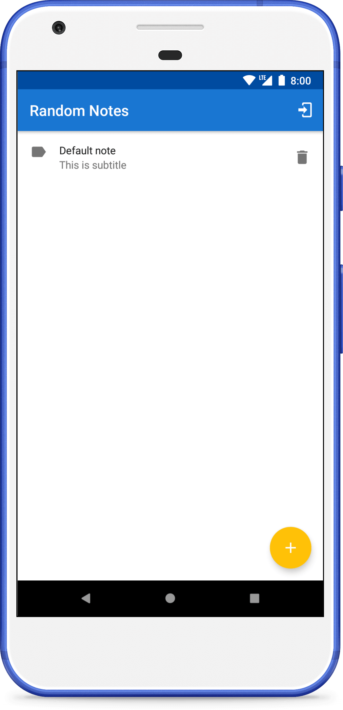
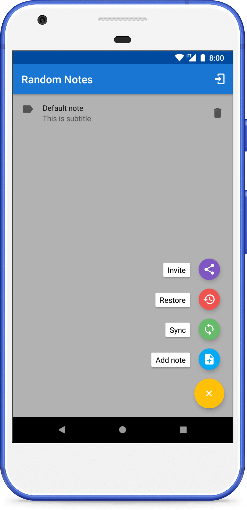
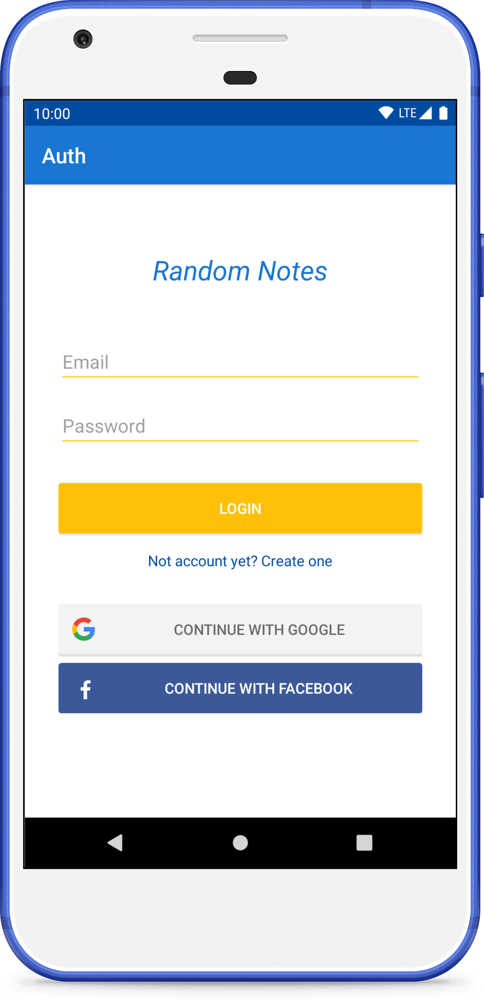
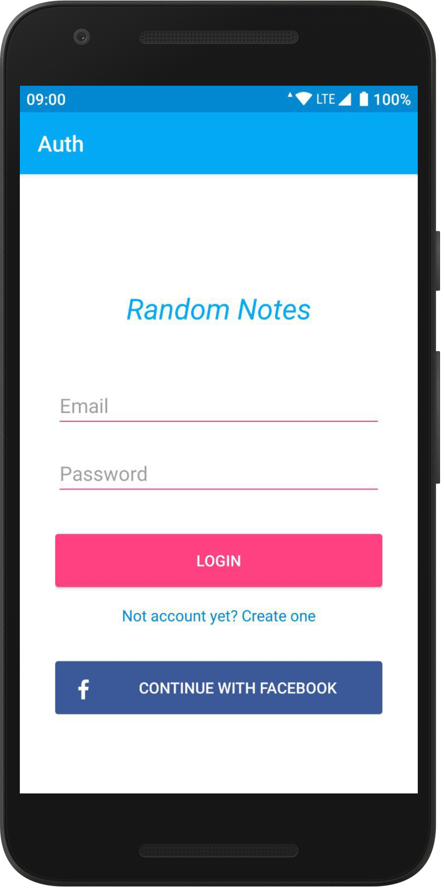

Random Notes
=============

[](https://travis-ci.org/fartem/parse-android-test-app)
[](https://codebeat.co/projects/github-com-fartem-parse-android-test-app-master)
[](https://codecov.io/gh/fartem/parse-android-test-app)
[](https://hitsofcode.com/view/github/fartem/parse-android-test-app)
[](https://android-arsenal.com/details/3/7906)

About
-------------

Test Android application for [Parse test server](https://github.com/fartem/parse-test-server).

__Features__

* sync data with the server;
* restore data from the server;
* sign up from the application with email address, Google or Facebook;
* sign in to the server with email address, Google or Facebook.

__Not handling exceptions__

* Internet disconnect;
* Parse Server connection status.

Google auth
-------------

__Resources__

* [Official Guide](https://developers.google.com/identity/sign-in/android/start-integrating).

__Usage__

In `preferences.xml` replace this value to own analogue:

```xml
<string name="google_web_app_token_id">[APP_ID]</string>
```

Facebook auth
-------------

__Resources__

* [Official Guide](https://developers.facebook.com/docs/facebook-login/android)
* [Get hash with openssl in Windows](https://github.com/magus/react-native-facebook-login/issues/297#issuecomment-433816732)

__Usage__

In `preferences.xml` replace this values to own analogues:

```xml
<string name="facebook_app_id">[APP_ID]</string>
<string name="fb_login_protocol_scheme">fb[APP_ID]</string>
```

Downloads
---------


Screenshots
-------------

<p align="center">
  
  
  
  
</p>

How to contribute
-------------

Read [Commit Convention](https://github.com/fartem/repository-rules/blob/master/commit-convention/COMMIT_CONVENTION.md). Make sure your build is green before you contribute your pull request. Then:

```shell
gradlew clean
gradlew build
gradlew connectedCheck
```

If you don't see any error messages, submit your pull request.

Contributors
-------------------

* [@fartem](https://github.com/fartem) as Artem Fomchenkov
